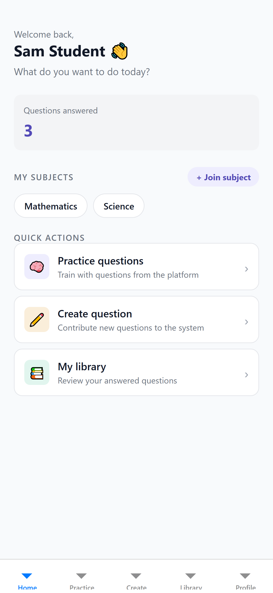
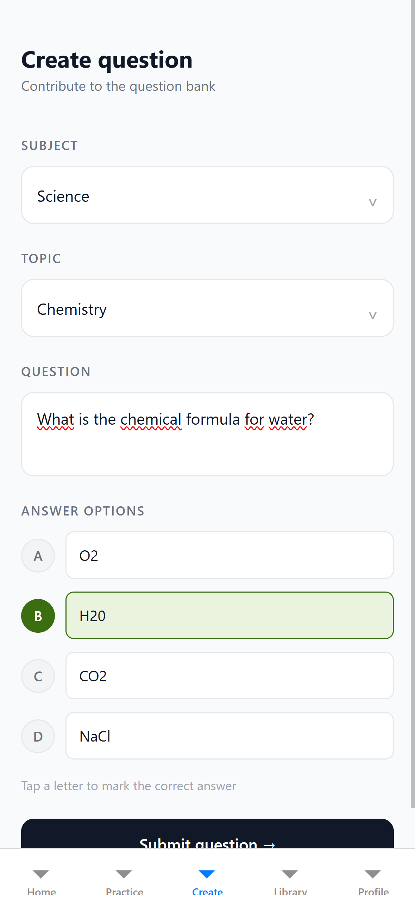
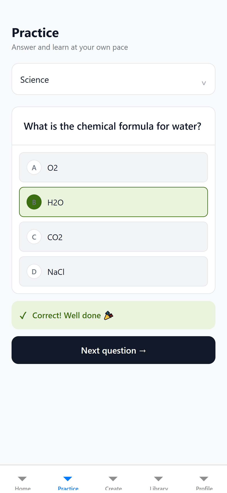

<div align="center">


**Banco de preguntas tipo test construido por el alumnado y validado por el profesorado.**

Aplicación multiplataforma — web, iOS y Android — desde un único código base.

[](https://adoptium.net/)
[](https://spring.io/projects/spring-boot)
[](https://reactnative.dev/)
[](https://expo.dev/)
[](https://www.postgresql.org/)
[](#pruebas)

</div>

---

## Qué problema resuelve

Practicar con preguntas tipo test funciona, pero depende de disponer de un banco amplio y actualizado. Elaborarlo recae normalmente sobre el docente: el esfuerzo es alto, el banco crece despacio y el alumnado queda como mero consumidor.

**AutoTest le da la vuelta.** Son los estudiantes quienes proponen las preguntas de sus asignaturas, y el profesorado actúa como revisor: aprueba o rechaza cada propuesta antes de que se consolide en el banco común. El banco crece de forma colaborativa sin que nadie renuncie al control de calidad, y formular una buena pregunta se convierte en sí mismo en un ejercicio de estudio.

## Cómo funciona

```
  Estudiante                Profesor                  Estudiante
┌─────────────┐         ┌──────────────┐          ┌──────────────┐
│   Propone   │  ────►  │    Revisa    │   ────►  │   Practica   │
│una pregunta │         │aprueba/rechaza│          │  con feedback│
└─────────────┘         └──────────────┘          └──────────────┘
       ▲                                                   │
       └───────────────────────────────────────────────────┘
                   el banco crece con el uso
```

El profesor crea una asignatura con sus temas y reparte un **código de invitación**. Los estudiantes se unen con ese código, proponen preguntas y practican. El sistema registra qué ha respondido cada uno para no repetirle preguntas mientras le queden nuevas.

## Funcionalidades

| | Estudiante | Profesor |
|---|---|---|
| **Asignaturas** | Se une mediante código de invitación | Las crea, con sus temas y código |
| **Preguntas** | Propone preguntas tipo test | Aprueba, rechaza o salta cada propuesta |
| **Práctica** | Responde con retroalimentación inmediata | — |
| **Biblioteca** | Consulta lo respondido, por asignatura y tema | Consulta lo aprobado y lo rechazado |

Además:

- **Autenticación con JWT** y control de acceso por rol, más autorización a nivel de recurso: nadie opera sobre asignaturas a las que no pertenece.
- **Contraseñas con BCrypt**, con sal distinta por contraseña.
- **Priorización inteligente** de la práctica: primero lo aprobado y no respondido, luego lo pendiente de revisar —avisando de que aún no está validado— y, si se agota, repaso de lo ya contestado.
- **Un solo código base** para navegador, iOS y Android.

## Capturas

<div align="center">




</div>

## Puesta en marcha

**Requisitos:** [JDK 21](https://adoptium.net/), [Docker](https://docs.docker.com/get-docker/) con Compose, [Node.js 20+](https://nodejs.org/) y Git. No hace falta instalar PostgreSQL ni Maven.

### 1. Clonar y configurar

```bash
git clone https://github.com/manchilop/autotest.git
cd autotest
cp .env.example .env          # Windows: Copy-Item .env.example .env
```

Edita el `.env` para sustituir `JWT_SECRET` por una cadena aleatoria de al menos 32 caracteres. Los valores de base de datos funcionan tal cual.

### 2. Levantar la base de datos

```bash
docker compose up -d
docker compose ps             # STATUS debe indicar "healthy"
```

El contenedor crea la base de datos y su usuario; las tablas las genera Hibernate al arrancar el backend.

### 3. Arrancar el backend

```bash
./mvnw spring-boot:run        # queda escuchando en el puerto 8080
```

Comprueba que todo ha ido bien:

```bash
curl -X POST http://localhost:8080/auth/login \
     -H "Content-Type: application/json" \
     -d '{"email":"teacher@autotest.dev","password":"Password123!"}'
```

Si responde con un token, el servidor funciona, la base de datos está conectada y los datos de ejemplo se han cargado.

### 4. Arrancar el cliente

```bash
cd frontend
npm install
npx expo start
```

Pulsa `w` para abrirlo en el navegador, o escanea el QR con **Expo Go** para usarlo en el móvil.

### Cuentas de ejemplo

Al arrancar con la base de datos vacía se crean estas cuentas, junto con dos asignaturas, cuatro temas y ocho preguntas. El registro desde la app siempre crea estudiantes, así que esta es la vía para tener un profesor.

| Correo | Contraseña | Rol |
|---|---|---|
| `teacher@autotest.dev` | `Password123!` | Profesor |
| `student1@autotest.dev` | `Password123!` | Estudiante |
| `student2@autotest.dev` | `Password123!` | Estudiante |

> Para partir de una base de datos limpia, arranca con `SEED_DB=false`.

### Dirección del backend según el entorno

`localhost` no significa lo mismo desde cada sitio. Se configura en `frontend/src/services/api.ts`:

| Entorno | Dirección |
|---|---|
| Navegador y simulador de iOS | `http://localhost:8080` |
| Emulador de Android | `http://10.0.2.2:8080` |
| Dispositivo físico con Expo Go | `http://<IP-de-tu-equipo>:8080` |

## Arquitectura

Cliente-servidor desacoplado sobre una API REST. El backend sigue una arquitectura por capas y concentra toda la lógica; el cliente solo presenta.

```
autotest/
├─ src/main/java/com/example/autotest_backend/
│  ├─ controller/      endpoints REST
│  ├─ service/         lógica de negocio y autorización por recurso
│  ├─ repository/      acceso a datos, con JPQL para la práctica
│  ├─ model/           entidades JPA
│  ├─ dto/ · mapper/   DTO y conversión con MapStruct
│  └─ security/        JWT y filtro de autenticación
├─ src/test/java/      118 pruebas automatizadas
├─ frontend/
│  └─ src/
│     ├─ app/          pantallas, con enrutado por ficheros
│     ├─ services/     cliente HTTP
│     └─ store/        sesión y contexto de autenticación
└─ docker-compose.yml  PostgreSQL
```

**Backend:** Java 21 · Spring Boot 3.5.8 · Spring Security · Spring Data JPA con Hibernate · PostgreSQL 16 · MapStruct · Lombok · jjwt

**Cliente:** React Native 0.81 · Expo SDK 54 · TypeScript 5.9 · expo-router · axios · AsyncStorage

## Pruebas

```bash
./mvnw test
```

**118 pruebas** que no requieren ningún servicio externo: la de arranque usa H2 en memoria. Se reparten entre servicios de negocio (52), capa web (44), seguridad (11), mapeo y manejo de errores (10) y arranque (1).

Cubren, entre otras cosas, el aislamiento entre asignaturas, los tokens caducados o manipulados, el acceso con el rol incorrecto y los casos límite de la práctica.

## Convenciones

Ramas por funcionalidad integradas mediante *pull request*, y mensajes de commit según [Conventional Commits](https://www.conventionalcommits.org/):

`feat` · `fix` · `refactor` · `docs` · `test` · `chore`

## Estado y trabajo futuro

Versión **v1.1.0**, funcional de extremo a extremo en las tres plataformas. Pendiente:

- [ ] Despliegue en un entorno permanente, con HTTPS
- [ ] Registrar la opción elegida y la fecha de cada respuesta, para analíticas
- [ ] Guardar quién propuso cada pregunta, para dar trazabilidad a las aportaciones
- [ ] Notificaciones, estadísticas y gamificación
- [ ] Pruebas de integración con Testcontainers y cobertura con JaCoCo

## Sobre el proyecto

Trabajo de Fin de Grado del **Grado en Ingeniería Informática – Ingeniería del Software** de la Universidad de Sevilla.

**Autor:** Manuel Chica López · **Tutor:** José María Luna Romera · Departamento de Lenguajes y Sistemas Informáticos
